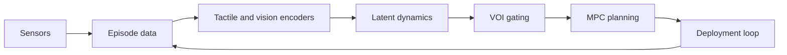

# TF-WM: Tactile-First World Models

TF-WM is a research codebase for learning tactile-first world models for robotic manipulation under occlusion and limited vision access.

## Overview

Traditional robotic manipulation relies heavily on vision for state estimation and planning. However, in many real-world scenarios, vision is occluded, unreliable, or expensive to query. TF-WM addresses this by treating high-frequency tactile contact streams as the primary state variable, learning dynamics and affordances in tactile latent space, and gating vision access based on uncertainty and value-of-information (VOI).

Key components:

- **Tactile Encoders**: Causal temporal models (TCN, Transformer, Hybrid) that encode tactile streams into latent representations.
- **Dynamics Models**: Predictive models of tactile evolution, supporting both deterministic and variational formulations.
- **Gating Mechanisms**: Uncertainty-based or VOI-supervised gates that decide when to query vision.
- **Latent Planners**: MPC with CEM in tactile latent space for planning actions.
- **Sim-to-Real**: Noise modeling, domain randomization, and adversarial alignment for real deployment.

## Installation

```bash
git clone https://github.com/aryanch09/tf-wm.git
cd tf-wm
uv sync
pre-commit install
```

## Quick Start

```bash
# Collect simulation data
tfwm collect task=inhand_reorient n_episodes=10000 sim=mujoco

# Train representation (Phase 1)
tfwm train phase=phase1 task=inhand_reorient

# Train gating (Phase 2)
tfwm train phase=phase2 task=inhand_reorient

# Evaluate
tfwm eval benchmark=inhand_reorient_occluded
```

## Architecture



The system consists of:

1. **Sensors**: Abstractions for tactile, vision, and proprioceptive sensors.
2. **Data Pipeline**: Episode buffers, datasets, and collation for variable-length tactile sequences.
3. **Models**: Encoders, dynamics, decoders, and gating networks.
4. **Planning**: Latent MPC planners with safety filters.
5. **Policies**: Imitation and reinforcement learning policies.
6. **Training**: Phased training recipes with Hydra configs.
7. **Evaluation**: Benchmarks, metrics, and visualization.
8. **Deployment**: Real-time loops for hardware.

## Research Claims

- **H-A**: ≥15% success rate improvement on occluded in-hand reorientation vs. vision-first baselines.
- **H-B**: ≥40% reduction in camera queries with <5% success rate drop via VOI gating.
- **H-C**: ≤10% sim-to-real gap with ≤500 real episodes.

## Contributing

See [CONTRIBUTING.md](https://github.com/aryanch09/tf-wm/blob/main/CONTRIBUTING.md) for development setup and guidelines.

## License

Apache 2.0
